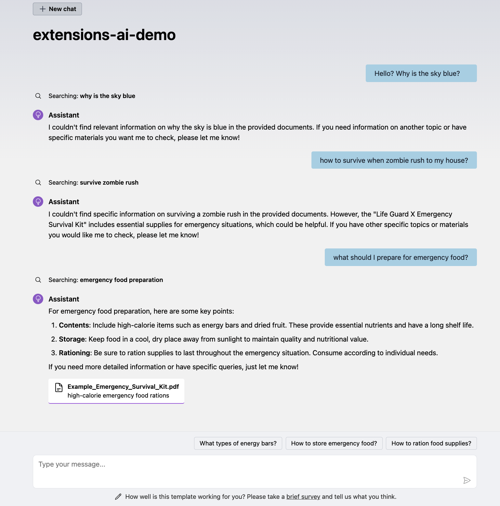
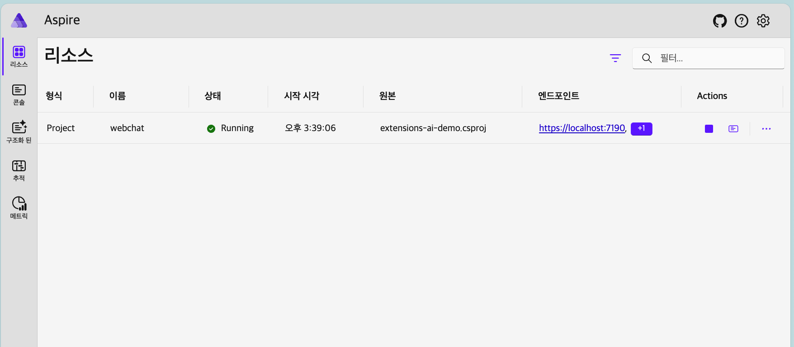
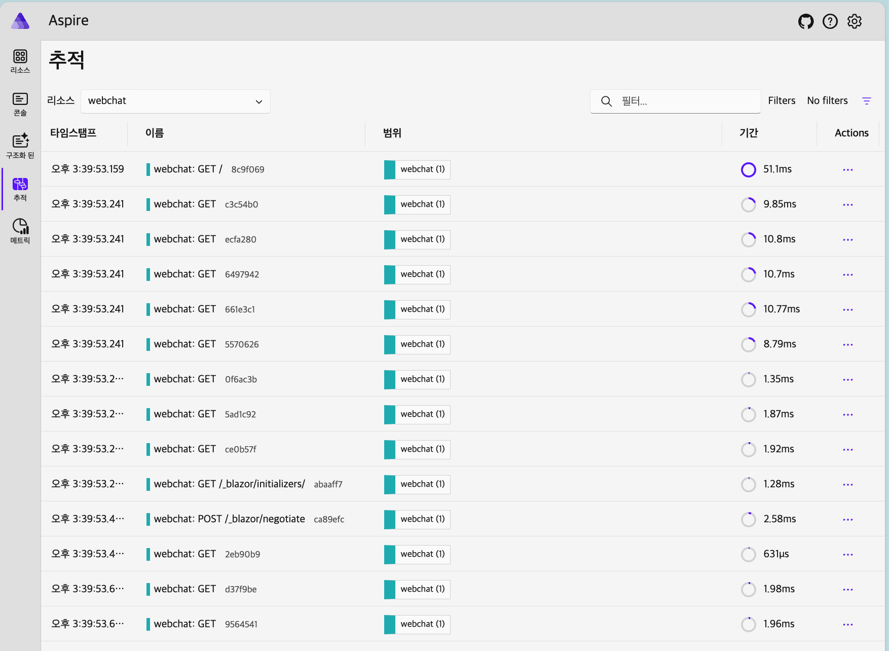
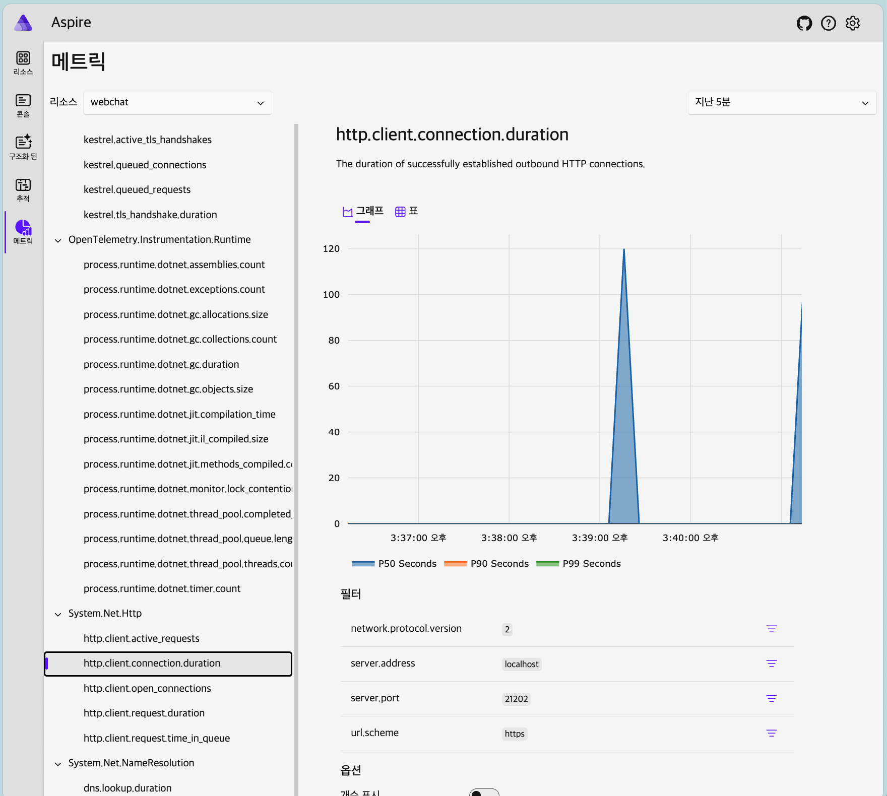
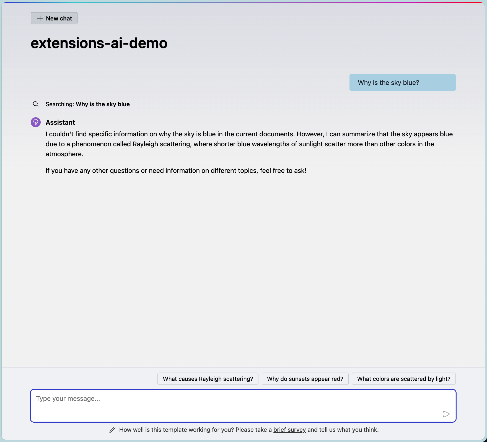

# README
- `Microsoft.Extensions.AI.Templates`의 데모 레포입니다.

## Getting Started
- 이렇게 빌드합니다.
```
cd src
dotnet restore && dotnet build
dotnet watch run --project Aspire.AppHost/Aspire.AppHost.csproj
```

## 01. Extensions.AI.Templates 생성하기
- 폴더구조
```
- src
  - Extensions.AI.Templates
```

- 환경설정
```
dotnet new install Microsoft.Extensions.AI.Templates
dotnet new aichatweb # TODO: 폴더,파일명 이슈
cd <<your-project-directory>>
dotnet user-secrets set GitHubModels:Token YOUR-TOKEN
```

- 빌드/실행
```
dotnet run --project <<your-project-directory>>/extensions-ai-demo.csproj
```


- 내장된 PDF 기반으로 검색증강 채팅 데모

## 02. Aspire AppHost로 통합하기
- 폴더구조
```
- src
  - Extensions.AI.Templates
  - Aspire.AppHost
  - Aspire.ServiceDefaults
```

- 환경설정
```
# aspire 템플릿 생성
dotnet new aspire # TODO: 폴더,파일명 이슈
dotnet sln solution.sln add Extensions.AI.Templates/extensions-ai-demo.csproj

# AppHost에 webchat 통함
cd Aspire.AppHost
dotnet add reference ../Extensions.AI.Templates

# ServiceDefaults 설정
cd Extensions.AI.Template
dotnet add reference ../Aspire.ServiceDefaults
```
- 환경설정후 AppHost 빌더에 Extensions.AI.Templates를 추가
- Extensions.AI.Templates에는 ServiceDefaults를 설정

- 빌드/실행
```
dotnet restore && dotnet build
dotnet watch run --project Aspire.AppHost/Aspire.AppHost.csproj
# TODO: aspire service discovery 이슈
```





- aspire에 통합해서 호스팅했고, 각종 메트릭을 수집하고 있다.
- [Service Defaults(세부내용 링크참조)](https://learn.microsoft.com/en-us/dotnet/aspire/fundamentals/service-defaults)를 통해 다음 디폴트 설정을 적용했다.
  - **OpenTelemetry 메트릭 및 추적 구성** : 메트릭 수집 표준, 시각화/분석은 이 프로젝트에선 대시보드에서 수행함.
  - **기본 헬스체크 엔드포인트 추가** : 대시보드에서 앱의 가용상태를 확인할 수 있음. 헬스체크 주기/방식 조정 가능함.
  - **서비스 디스커버리 기능** : 앱 이름으로 다른 서비스를 참조가능, 도커 컨테이너간 이름으로 참조하는 것과 유사함.

## TO BE CONTINUED ...
- Service Defaults 세부설정
- Github CI/CD Azure 배포 파이프라인
- Github CI/CD 린팅 구성

## REFERENCES
- **Extensions.AI.Templates 세부설정, 기여할 이슈찾기**
  - Microsoft.Extensions.AI.Templates : [nuget-저장소(링크)](https://www.nuget.org/packages/Microsoft.Extensions.AI.Templates), [github-저장소(링크)](https://github.com/dotnet/extensions/tree/a7f06f29f88311fae5c2dfcfab5561c428a349f2/src/ProjectTemplates/Microsoft.Extensions.AI.Templates), [관련이슈(링크)](https://github.com/dotnet/extensions/issues?q=is%3Aissue%20state%3Aopen%20label%3Aarea-ai-templates)
  - Microsoft.Extensions.AI : [nuget-저장소(링크)](https://www.nuget.org/packages/Microsoft.Extensions.AI.Abstractions/#readme-body-tab), [github-저장소(링크)](https://github.com/dotnet/extensions/tree/a7f06f29f88311fae5c2dfcfab5561c428a349f2/src/Libraries/Microsoft.Extensions.AI), [관련이슈(링크)](https://github.com/dotnet/extensions/issues?q=is%3Aissue%20state%3Aopen%20label%3Aarea-ai)
  - extensions ai 알려진 이슈 : dotnet 9.2 호환성 문제로 aspire 9.1까지 지원됨 https://github.com/dotnet/extensions/blob/a7f06f29f88311fae5c2dfcfab5561c428a349f2/src/ProjectTemplates/Microsoft.Extensions.AI.Templates/src/ChatWithCustomData/README.Aspire.md#known-issues
  - 관련 로드맵 : dotnet 개발자를 위한 AI https://learn.microsoft.com/ko-kr/dotnet/ai/
- **Semantic Kernel과 Extensions.AI의 차이점은?**
  - [Microsoft.Extensions.AI: Simplifying AI Integration for .NET Partners(링크)](https://devblogs.microsoft.com/semantic-kernel/microsoft-extensions-ai-simplifying-ai-integration-for-net-partners/)에 따르면,
  - `Microsoft.SemanticKernel.Abstractions`의 추상 계층에 기반한 라이브러리
  - 각 AI 벤더사에서 보다 유연하게 자체 구현을 제공할 수 있도록 제공됨
